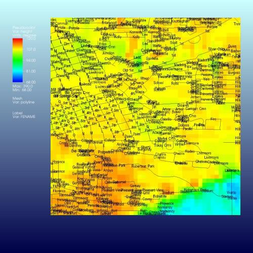
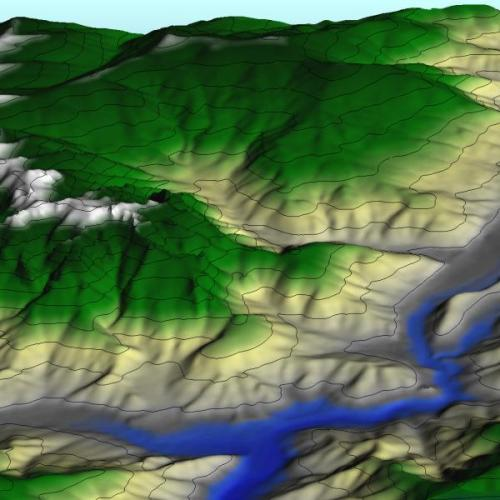
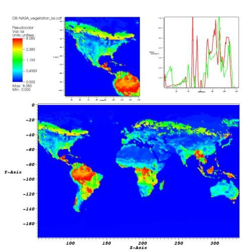

VisIt comes preinstalled with a small set of example Silo files that
you can plot to familiarize yourself with using VisIt. VisIt can read
and process data from many different file formats. For a partial list
of the supported file formats, you can look at the file formats table
on the Frequently Asked Questions page. This page provides links to
other sites where you can download data in some of the other file
formats that VisIt supports. If you want to know how to create data
files that VisIt can read, please read the Getting Data Into VisIt
manual. You can find additional information on getting your data into
VisIt at visitusers.org. If you want us to add a link to your data here,
send an e-mail to the VisIt Webmaster.

|**File Format**|**Example Image**|**File Format**|**Example Image**|
|[VisIt Test Data][silo]|[][silo]|[ESRI Shapefile][esri]|[{:width="150px"}][esri]|
|[DEM][dem]|[{:width="150px"}][dem]|[NetCDF][netcdf]|[{:width="150px"}][netcdf]|

[silo]: https://wci.llnl.gov/content/assets/docs/simulation/computer-codes/visit/visit_data_files.tar.gz
[esri]: http://arcdata.esri.com/data/tiger2000/tiger_download.cfm
[dem]: http://data.geocomm.com/dem/demdownload.html
[netcdf]: http://www.unidata.ucar.edu/software/netcdf/examples/files.html
