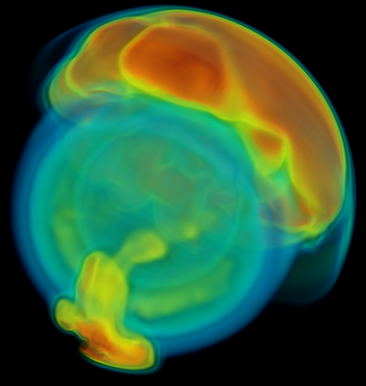

## Leading examples of using VisIt at scale

On this page, we present various examples of using VisIt at scale.
We would like to keep this information up to date, so we encourage
anyone who is aware of good examples to please feel welcome to send
email to visit-users@ornl.gov with information you would like to add
to this page.

Mz=Million Zones (106), Bz=Billion Zones (109), Tz=Trillion Zones (1012)

|Zones/ state|#states|Total zones|Mesh+ vars|Platform|Visioneers|More info...|
|20,0013|1|8 Tz|Rect+1|12,000 cpus of [Graph](https://computing.llnl.gov/?set=resources&page=SCF_resources#graph)|Cyrus Harrison|[{:width="50px"}](http://www.hpcwire.com/topic/visualization/DOE-Researchers-Test-Limits-of-Visualization-Tool-47533672.html?viewAll=y)|
|15,8713|1|4 Tz|Rect+1|65,536 cpus of [Dawn](https://computing.llnl.gov/tutorials/bgp/#Whatis)|Brad Whitlock|[{:width="50px"}](https://computing.llnl.gov/tutorials/bgp/#Whatis)|
|12,5963|1|2 Tz|Rect+1|32,000 cpus of [Jaguar](https://en.wikipedia.org/wiki/Jaguar_(supercomputer))|Dave Pugmire Sean Ahern|[{:width="50px"}](http://www.hpcwire.com/topic/visualization/DOE-Researchers-Test-Limits-of-Visualization-Tool-47533672.html?viewAll=y)|
|12,5963|1|2 Tz|Rect+1|32,000 cpus of [Franklin](https://www.top500.org/system/176150)|Mark Howison Prabhat Hank Childs|[{:width="50px"}](http://www.hpcwire.com/topic/visualization/DOE-Researchers-Test-Limits-of-Visualization-Tool-47533672.html?viewAll=y)|
|10,0003|1|1 Tz|Rect+1|16,000 cpus of [Jaguar](https://en.wikipedia.org/wiki/Jaguar_(supercomputer))|David Pugmire Sean Ahern|[{:width="50px"}](https://cacm.acm.org/news/30613-doe-researchers-test-limits-of-visualization-tool/fulltext?mobile=false)|
|10,0003|1|1 Tz|Rect+1|16,000 cpus of [Ranger](https://www.top500.org/system/176183)|Hank Childs|[{:width="50px"}](https://cacm.acm.org/news/30613-doe-researchers-test-limits-of-visualization-tool/fulltext?mobile=false)|
|10,0003|1|1 Tz|Rect+1|16,000 cpus of [Juno](https://www.top500.org/system/176209)|Hank Childs|[{:width="50px"}](https://cacm.acm.org/news/30613-doe-researchers-test-limits-of-visualization-tool/fulltext?mobile=false)|
|10,0003|1|1 Tz|Rect+1|16,000 cpus of [Franklin](https://www.top500.org/system/176150)|Mark Howison Prabhat Hank Childs|[{:width="50px"}](https://cacm.acm.org/news/30613-doe-researchers-test-limits-of-visualization-tool/fulltext?mobile=false)|
|80003|1|0.5 Tz|Rect+1|8,000 cpus of [Purple](https://www.top500.org/system/174683)|Hank Childs|[{:width="50px"}](https://cacm.acm.org/news/30613-doe-researchers-test-limits-of-visualization-tool/fulltext?mobile=false)|
|40003|1|64 Bz|Rect+1|4,000 cpus of [Ranger](https://www.top500.org/system/176183)|Hank Childs Cyrus Harrison||
|30003|1|27 Bz|Rect+3||Hank Childs|{:width="50px"}|
|11523|400+|1.52 Bz|Rect+1||Hank Childs Daniel Laney Mark C Miller|[{:width="50px"}](https://asc.llnl.gov/computing_resources/bluegenel/papers/cabot.pdf)|
|7202x1620|1000+|0.85 Tz|Rect+1|125 cpus of [MCR](https://www.top500.org/system/167394)|Hank Childs Daniel Laney Mark C Miller|[{:width="50px"}](https://asc.llnl.gov/computing_resources/bluegenel/papers/cabot.pdf)|
|3600x3082|1|340 Mz|Rect+4|128 cpus of [Franklin](https://www.top500.org/system/176150)|Gunther H. Weber Cameron Geddes||
